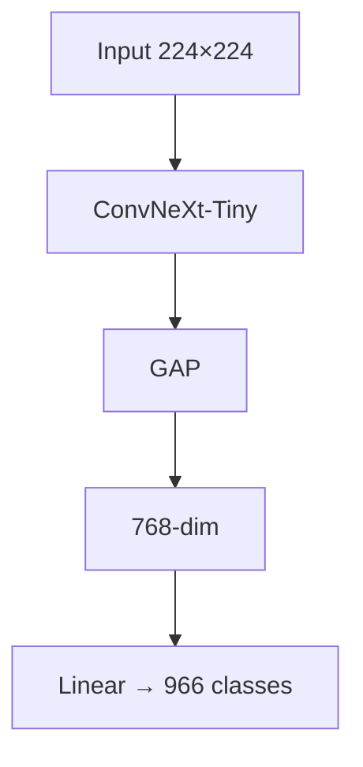
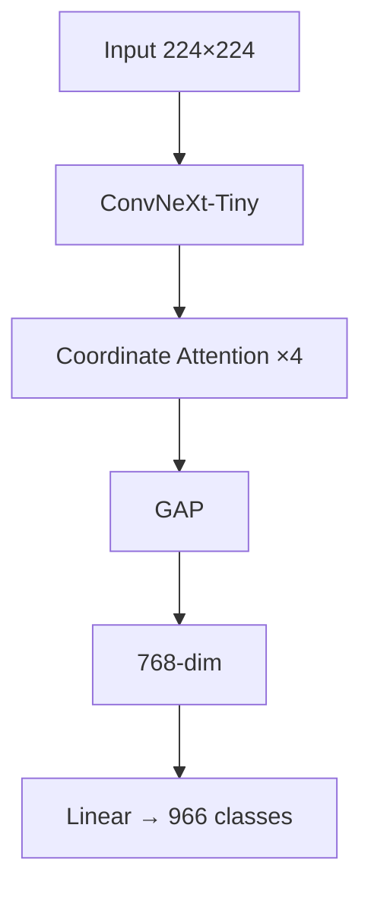
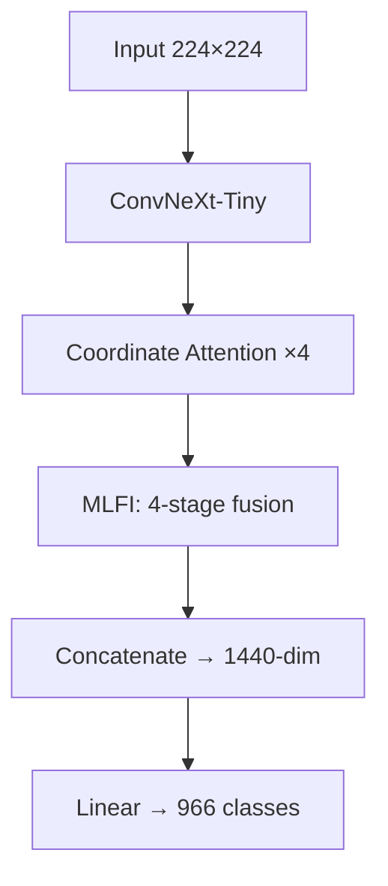

# Presentation Outline: 10 Slides

### Phase 1 — Baseline

### Phase 2 — +Coordinate Attention

### Phase 3 — +CA +MLFI

## Classification of Indian Lepidoptera Species — Extended Training Results

> All data sourced from `report_assets/report_assets/`. File paths are relative to that directory.

---

### Slide 1: Title Slide
- **Title:** Classification of Indian Lepidoptera Species: Fine-Grained Recognition Under Domain Shift
- Team: Akshit Bansal, Jayendra Singh, Kriti Chaturvedi, Sirjan Singh, Priyal Maheswari
- Course: Deep Learning for Computer Vision (CSE3292)
- Date: April 2026
- **Visual:** A collage of butterfly specimens from the dataset (select 4–5 species showing morphological similarity)

---

### Slide 2: Why This Problem Is Hard (Motivation)
**Key message:** Standard CNNs fail on this task for structural reasons, not just scale.

**Content:**
- India = 1,500+ butterfly species, biodiversity hotspot
- Three structural challenges (with example images):
  1. **Spatial specificity** — *where* a wing pattern is located matters (eyespot forewing vs hindwing = different genus)
  2. **Multi-scale dependence** — submarginal bands (low-level) + wing shape (high-level) both needed
  3. **Extreme class imbalance** — 966 classes, ranging from >500 images to <5 images
- Head-Only accuracy = **53.20%** → "ImageNet features are blind to wing morphology"

**Graphs:** None on this slide — use annotated butterfly images showing discriminative features

---

### Slide 3: Dataset — IndoLepAtlas
**Key message:** How we built a domain-specific Indian butterfly dataset.

**Content:**
- **Source:** indiabutterflies.com + iNaturalist India (GBIF)
- **Pipeline:** Web scraping → metadata extraction (GPS, date) → state-to-biogeographic zone mapping → data_audit.py
- **Final stats:** 24,825 images, 966 species, 34 states, 9 biogeographic zones
- **Strata:** Dense (≥50 images/class) vs Sparse (<50 images/class)
- Metadata coverage: 98.3% (location), 76.1% (date)

**Graphs:**
- Class frequency histogram (log scale) — generate from dataset or use a bar chart of class distribution
- Geographic heatmap of sample counts per state

---

### Slide 4: Architecture Overview — The Progressive Pipeline
**Key message:** Each component is added as a "phase" to enable clean ablation.

**Content:**
- **Diagram:** Input → ConvNeXt-Tiny (4 stages) → [CA ×4] → [MLFI → 1440-dim] → LN+Dropout+Linear → 966 logits
- Phase 1: Backbone only (768-dim)
- Phase 2: + Coordinate Attention after each stage
- Phase 3: + MLFI multi-level fusion (1440-dim = 192 + 384 + 96 + 768)
- Training: AdamW, cosine annealing, 5-epoch warmup, differential LR (backbone 0.1×)

**Graphs:** Architecture block diagram (hand-drawn or TikZ). Show parameter counts per phase.

---

### Slide 5: Unit I — Loss & Sampling Strategy (30 Epochs)
**Key message:** Balanced sampling + CE dominates. Focal Loss over-regularises Dense classes.

**Content:**
| Setup | Top-1 | Macro-F1 | Dense | Sparse |
|---|---|---|---|---|
| **CE + Balanced** | **87.06%** | **85.48%** | 87.67% | 85.84% |
| CE + Unbalanced | 87.60% | 80.23% | 91.22% | 80.35% |
| Focal + Balanced | 82.69% | 82.64% | 80.85% | 86.40% |
| Focal + Unbalanced | 84.83% | 82.70% | 85.70% | 83.07% |

- CE+Unbalanced: highest Top-1 but **5.25-point Macro-F1 gap** → "Unbalanced Illusion"
- Focal Loss boosts Sparse (86.40%) but destroys Dense (80.85%)
- Balanced sampling compresses Dense–Sparse gap to 1.83 points

**Graphs (pick 2–3):**
1. 📊 `plots/unit1_bar_comparison.png` — Side-by-side bar chart of all 4 configs across metrics
2. 📈 `plots/unit1_training_curves.png` — Loss/accuracy curves showing convergence behaviour
3. 📊 `plots/stratum_comparison.png` — Dense vs Sparse accuracy across all configs (KEY GRAPH)
4. 🔥 `confusion_heatmaps/unit1_ce_bal_confusion.png` vs `unit1_ce_unbal_confusion.png` — Show how unbalanced training concentrates predictions on Dense classes

---

### Slide 6: Why Coordinate Attention? (Not SE-Net, Not CBAM)
**Key message:** CA preserves *positional* information that SE-Net destroys — and it matters for wing patterns.

**Content:**
- **SE-Net problem:** Global avg pool → collapses spatial dims → loses *where* the pattern is
- **CA solution:** Axis-decomposed attention along H and W independently
  - Pools along width → height attention map (captures horizontal wing banding)
  - Pools along height → width attention map (captures vertical vein streaking)
- Placed after each of 4 stages — only 4 modules, minimal parameter overhead
- **Result:** Sparse-class accuracy jumps from 86.76% → **88.05%** (+1.29 points)

**Graphs:**
- Attention mechanism comparison diagram (SE-Net vs CA — block diagrams)
- Optional: `per_run_curves/unit2_phase2_metrics_curve.png` showing Phase 2 convergence

---

### Slide 7: Unit II — Feature Fusion Ablation (40 Epochs)
**Key message:** CA improves rare-class performance; MLFI shows promise but adds optimisation complexity.

**Content:**
| Architecture | Top-1 | Macro-F1 | Dense | Sparse |
|---|---|---|---|---|
| Phase 1 (Baseline) | 86.50% | 85.65% | 86.36% | 86.76% |
| **Phase 2 (+ CA)** | **86.77%** | **85.75%** | 86.13% | **88.05%** |
| Phase 3 (+ CA + MLFI) | 84.43% | 83.34% | 83.32% | 86.66% |

- MLFI adds ~12M params with Xavier init → optimisation imbalance with near-converged backbone
- MLFI Sparse accuracy (86.66%) still strong — multi-level fusion benefits rare classes
- The 2-point Top-1 gap is an **optimisation** problem, not an architecture problem

**Graphs (pick 2–3):**
1. 📊 `plots/unit2_bar_comparison.png` — Bar chart comparing 3 phases
2. 📈 `plots/unit2_training_curves.png` — Training curves showing Phase 3's slower convergence
3. 📈 `per_run_curves/unit2_phase3_metrics_curve.png` — Phase 3 val accuracy still climbing at epoch 40
4. 🔥 `confusion_heatmaps/unit2_phase2_confusion.png` vs `unit2_phase3_confusion.png` — Compare confusion patterns

---

### Slide 8: Unit III — Transfer Learning & Domain Shift (40 Epochs)
**Key message:** ImageNet features catastrophically fail for butterflies. Full fine-tuning is mandatory.

**Content:**
| Strategy | Top-1 | Macro-F1 | Dense | Sparse |
|---|---|---|---|---|
| **End-to-End** | **84.79%** | **84.11%** | **83.89%** | 86.61% |
| Freeze Late | 84.33% | 84.02% | 83.15% | 86.71% |
| Freeze Early | 83.77% | 83.20% | 82.74% | 85.84% |
| **Head Only** | **53.20%** | **57.02%** | **44.46%** | **70.75%** |

- **Head-Only Dense (44.46%) < Sparse (70.75%)** → striking inversion proves ImageNet features actively interfere with Dense-class discrimination
- Freeze Late > Freeze Early → early layers (edge detectors) need domain recalibration
- End-to-End is mandatory; partial freezing is marginal (Δ < 1%)

**Graphs (pick 2–3):**
1. 📊 `plots/unit3_bar_comparison.png` — Bar chart showing the Head-Only cliff
2. 📈 `plots/unit3_training_curves.png` — Training curves for all 4 strategies
3. 🔥 `confusion_heatmaps/unit3_head_only_confusion.png` — Show the chaotic confusion pattern
4. 📈 `per_run_curves/unit3_head_only_metrics_curve.png` — Head-only learning curve saturating early

---

### Slide 9: Cross-Unit Analysis & Master Results
**Key message:** The three interventions are complementary; balanced sampling has the highest ROI.

**Content:**
- Show the complete 11-config master table (condensed)
- **Best overall:** CE + Balanced (87.06% Top-1, 85.48% F1)
- **Best Sparse:** Phase 2 + CA (88.05%)
- **Top-5 accuracy > 96.6%** for all configs except Head-Only → confusion is between morphologically similar species pairs
- Dense–Sparse gap analysis: balanced sampling compresses it most effectively

**Graphs:**
1. 🎯 `plots/best_models_radar.png` — **KEY GRAPH**: Radar chart comparing best config from each unit across all metrics
2. 📊 `plots/stratum_comparison.png` — Dense vs Sparse accuracy across all 11 configs

---

### Slide 10: Conclusion & Future Work
**Key message:** We know *why* each component matters.

**Three key findings:**
1. **Balanced CE** is the single most impactful intervention: 85.48% Macro-F1, 1.83-point Dense–Sparse gap (Unit I)
2. **Coordinate Attention** is high-value, low-cost: +1.29 points Sparse accuracy with minimal parameters (Unit II)
3. **ImageNet transfer fails** for biological domains: 53.20% Head-Only → end-to-end fine-tuning mandatory (Unit III)

**Future work:**
- MLFI optimisation: warm-up scheduling, progressive unfreezing to close the 2-point gap
- Phase 5: Geotemporal fusion (biogeographic zone + season encoding)
- Prototypical network heads for ~400 Sparse classes (<50 images)
- Domain-specific self-supervised pretraining (DINO on butterfly images)

**Thank you — Questions?**

---

## Graph Asset Reference Summary

| Asset File | Best Used On | What It Shows |
|---|---|---|
| `plots/unit1_bar_comparison.png` | Slide 5 | Unit I metrics comparison across 4 loss configs |
| `plots/unit1_training_curves.png` | Slide 5 | Unit I training loss/accuracy over 30 epochs |
| `plots/unit2_bar_comparison.png` | Slide 7 | Unit II metrics for Phase 1/2/3 |
| `plots/unit2_training_curves.png` | Slide 7 | Unit II convergence curves (Phase 3 slower) |
| `plots/unit3_bar_comparison.png` | Slide 8 | Unit III metrics showing Head-Only cliff |
| `plots/unit3_training_curves.png` | Slide 8 | Unit III learning curves for freeze strategies |
| `plots/best_models_radar.png` | Slide 9 | Radar chart of best model per unit |
| `plots/stratum_comparison.png` | Slides 5, 9 | Dense vs Sparse accuracy — the key equity metric |
| `confusion_heatmaps/unit1_ce_bal_confusion.png` | Slide 5 | CE+Balanced confusion matrix |
| `confusion_heatmaps/unit1_ce_unbal_confusion.png` | Slide 5 | CE+Unbalanced confusion (show bias) |
| `confusion_heatmaps/unit2_phase2_confusion.png` | Slide 7 | Phase 2 (CA) confusion |
| `confusion_heatmaps/unit3_head_only_confusion.png` | Slide 8 | Head-Only catastrophic confusion |
| `per_run_curves/unit2_phase3_metrics_curve.png` | Slide 7 | Phase 3 still improving at epoch 40 |
| `per_run_curves/unit3_head_only_metrics_curve.png` | Slide 8 | Head-only saturation curve |
